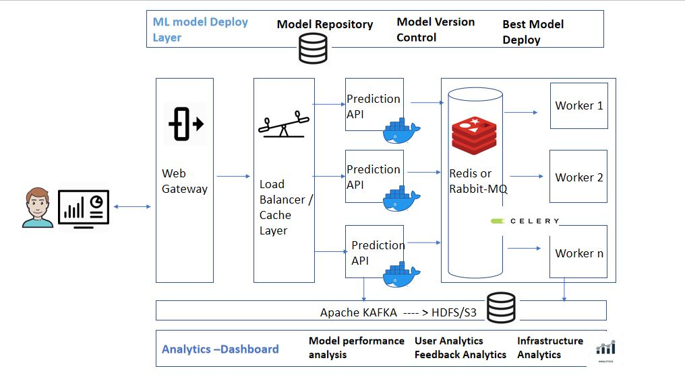

## Assignment

### Regression Problem

#### Identify/predict/recommend the price for given set of items

*input* :

	x1-15

*output (target)* :

	y_var
	
## Data science Steps:
	- Clean 
	- Visualize the data
		- Ask Questions
	- Feature Selection based on visualization and try brute force also
	- Modeling:
		- Linear Regression
		- polynomial Regression
		- Gradient Boosting
		- Xgboost
		- Catboost
		- LightGBM
		- H20
		- Try Formula (if target was not fitted properly)

## Deployment :
	You can assume 5000 listings are being created in our platform every minute through our iphone 
	or android app or website.

	- Scalable solution 
		- should be Horizontally scalable
	- Use load Balancer
		- async
		- docker
		- RPC call
	- Use message Queue
		- KAFKA
		- Redis
		- celery
		
	
	- Store the output of the model and data in some Big data systems (HDFS, S3, HIVE)
	
	- should not have single point of failure
	- Analytics as to be done
	- Feedback based training
	- Batch analytics

## Deployment Architecture

## Explanation:
  ### Give explanation for your prediction if needed
  - lime
  - SHAP

## Give confidence interval also for the price
## Feedback:
	- Take Feedback about the price recommendation
	- Use this Feedback to improve/train the models

## Attach Rest API 
	-Docker Deployment scripts

Try to prepare a Dashboard (Addons)
	

## Modeling 
- What are the Common price amount always happening for the given list of variables(x-var)? 
    - This is useful to get a intiution 
    - This can be used in final stage of modeling (we can tweak the model output , to get desired output at the last)
- Feature Selection using trained models
- Build Different Algorithms to predict the price
    - Linear, Lasso,Ridge
    - Xgboost,Catboost,LightGBM
    - Pytorch model (if needed)
	- Baseline model performance metrics
- Measure the model performance using 
    - Mean Absolute Error
    - Mean Squared Error
    - RMSE
- Benchmark Leaderboard of models using Different Hyperparameters
    - For above metrics(Error function in the test set)
    - Also for Prediction Time
	
- Confidence Interval Calculation 
    - Random Forest Confidence Intervals (using different Decision Trees)
    - Gradient Boosting using Quantile Intervals
- Explanation for the prediction
    - Shap
    - Lime

## Feature Selection	

Feature imporatance of all baseline models

|    |    linear_reg |         lasso |         ridge |         rf |         gbr |   cat_gbr |   light_gbr |
|---:|--------------:|--------------:|--------------:|-----------:|------------:|----------:|------------:|
|  0 |   2.23977     |   1.95428     |   2.23979     | 0.0112881  | 0.000124869 |  0.742056 |          26 |
|  1 |  -3.00007     |  -0           |  -3           | 0.0144287  | 0.00254696  |  1.45523  |          27 |
|  2 |  -0.0497457   |  -0.0584689   |  -0.0497475   | 0.0513834  | 0.00436767  |  4.42543  |         196 |
|  3 |  -1.50822     |  -1.40005     |  -1.50829     | 0.0741738  | 0.163885    | 13.1443   |         342 |
|  4 |  -0.638839    |  -0.614495    |  -0.63882     | 0.0734982  | 0.067889    |  9.07051  |         568 |
|  5 |   0.608251    |   0.609754    |   0.608252    | 0.304805   | 0.481872    | 30.1835   |         502 |
|  6 |  -0.000357175 |  -0.000236782 |  -0.000357118 | 0.0627593  | 0.0435428   |  6.78723  |         235 |
|  7 | 158.626       | 142.846       | 158.612       | 0.0771707  | 0.109547    | 12.0767   |         172 |
|  8 |  34.0068      |  30.371       |  34.0059      | 0.0128193  | 0.0155619   |  1.03683  |           6 |
|  9 |  -0.00218529  |  -0.00183329  |  -0.00218526  | 0.0879956  | 0.0108722   |  2.54453  |         190 |
| 10 |   0.17857     |   0.222073    |   0.178571    | 0.121091   | 0.0553608   |  5.73852  |         224 |
| 11 |  46.8198      |   8.60254     |  46.8128      | 0.00558398 | 0.00522745  |  5.86023  |          80 |
| 12 |  -0.00775879  |   0.0194101   |  -0.00774927  | 0.00479453 | 0.0008099   |  1.02793  |          50 |
| 13 | -15.9664      | -15.0783      | -15.9672      | 0.0498253  | 0.0130437   |  2.05423  |         175 |
| 14 |   0.00161799  |   0.00375283  |   0.00161861  | 0.0483828  | 0.0253482   |  3.8528   |         207 |
	

### Baseline Score of the trained models

 |      |   linear_reg |      lasso |      ridge |         rf |        gbr |    cat_gbr |   light_gbr |
|:-----|-------------:|-----------:|-----------:|-----------:|-----------:|-----------:|------------:|
| maae |      23.9081 |    24.9784 |    23.9086 |    22.1    |    23.3951 |    22.6081 |     22.4571 |
| mae  |      52.7526 |    52.9087 |    52.7526 |    55.2584 |    49.892  |    49.4214 |     49.6741 |
| mse  |   21382.3    | 21457.7    | 21382.4    | 23178.5    | 20087.1    | 19066.8    |  19289.1    |
| rmse |     146.227  |   146.484  |   146.227  |   152.245  |   141.729  |   138.083  |    138.885  |
	
-	Among all the models catboost Regressor performed well on the test dataset

	
	 
